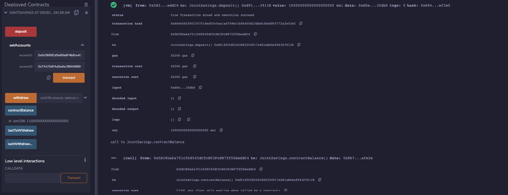

# Solidity--Joint-Savings-Account

## Contents
* [Overview of the Project](#overview-of-the-project)
* [Project Steps](README.md#project-steps)
    * [Step 1: Create the JointSavings Contract](README.md#step-1-create-a-joint-savings-account-contract-in-solidity)
    * [Step 2: Compile, Deploy and Interact](README.md#step-2-compile-deploy-and-interact-with-the-deployed-smart-contract-in-the-javascript-vm)
    * [Step 3 Test the Deployed Contract](README.md#step-3-test-the-deployed-contract)

---
## Overview of the project
To automate the creation of joint savings accounts, I create a Solidity smart contract that accepts two user addresses. These addresses will be able to control a joint savings account. The smart contract will use ether management functions to implement a financial institution’s requirements for providing the features of the joint savings account. These features will consist of the ability to deposit and withdraw funds from the account.

---

## Project Steps
### Step 1: Create a Joint Savings Account Contract in Solidity
* Open the [code](joint_savings.sol) in the Remix IDE.
* Define a new contract named JointSavings
    * Define the following variables in this contract:

* Define a function named withdraw 
    * accept two arguments: amount of type uint and recipient of type payable address.
    * Define require statements
    * Add an if statement to check if lastToWithdraw is not equal (!=) to recipient. If it's not equal, set it to the current value of recipient.
    * Call the transfer function of the recipient, and pass it the amount to transfer as an argument. Set lastToWithdraw equal to amount. Set the contractBalance variable.

* Define a `public payable` function named `deposit`.
    * Set the `contractBalance` variable equal to the balance of the contract by using `address(this).balance`.
* Define a `public` function named `setAccounts` that takes two `address payable` arguments, named `account1` and `account2`. In the body of the function, set the values of `accountOne` and `accountTwo` to `account1` and `account2`, respectively.
* Add a fallback function so that your contract can store ether that’s sent from outside the deposit function.

### Step 2: Compile, Deploy and Interact with the Deployed Smart Contract in the JavaScript VM
Use the `setAccounts` function to define the authorized Ethereum address that will be able to withdraw funds from your contract.

    Note: The following dummy Ethereum addresses were used for this example transaction. 
     
     Dummy account1 address: 0x0c0669Cd5e60a6F4b8ce437E4a4A007093D368Cb
     Dummy account2 address: 0x7A1f3dFAa0a4a19844B606CD6e91d693083B12c0

Compile and Deploy the JointSavings Contract.
Deploy the JointSavings Contract             |  Deployed Output
:-------------------------:|:-------------------------:
   |  

### Step 3 Test the Deployed Contract
**Transaction 1: Send 1 ether as wei**

**Transaction 2: Send 10 ether as wei**

**Transaction 3: Send 5 ether**

Once successfully deposited funds into your contract, test the contract’s withdrawal functionality by withdrawing 5 ether into `accountOne` and 10 ether into `accountTwo`. After each transaction, use the `contractBalance` function to verify that the funds were withdrawn from your contract. Also, use the `lastToWithdraw` and `lastWithdrawAmount` functions to verify that the address and amount were correct.

5 ether into accountOne             |  10 ether into accountTwo
:-------------------------:|:-------------------------:
   |  
